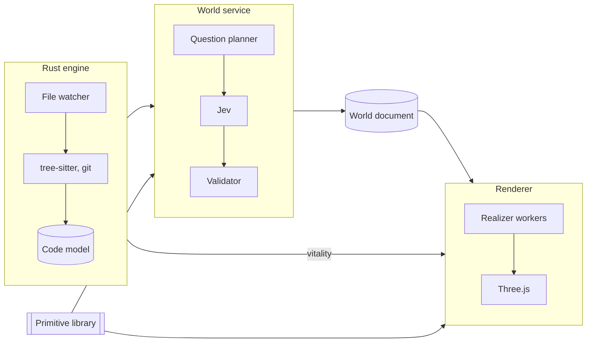

# Gaia

Gaia turns a codebase into a beautiful, living world you wander through. Jev
fills Gaia's typed world and component schemas from facts about the code, a
procedural engine grows the world from them, and every part of it shows the
health of the code it stands for.



The Rust engine turns files into the code model and holds the Jev key. The
world service asks Jev typed questions about that model and writes validated
answers into the world document. The renderer's realizer workers build
geometry from the document, and vitality comes straight from the code model,
so a failing test changes the world without a Jev call. Electron's main
process starts the engine and the world service and opens the window.
`docs/architecture.md` explains each part.

## Status

Slice 1 is the base: the packages, the four processes wired together, and the
lab, where every primitive, landform and world look is judged. The analyzer,
Jev and the world document arrive in later slices.

## Running

You need Node 26, pnpm 10 and a stable Rust toolchain from rustup.

```sh
pnpm install     # also points git at the pre-commit hook
pnpm dev         # builds the engine and opens the lab
pnpm check       # type checker, lint rules and tests
cargo test       # the engine's tests
pnpm shots       # screenshots of every primitive and world for review
pnpm lab:html    # the lab as one offline HTML file
```

## Contributing

Read `AGENTS.md` first. It holds the rules every change follows, how to add a
primitive, and how tests are written. `docs/design-system.md` holds the look,
and `docs/decisions/` records why each decision was made.
