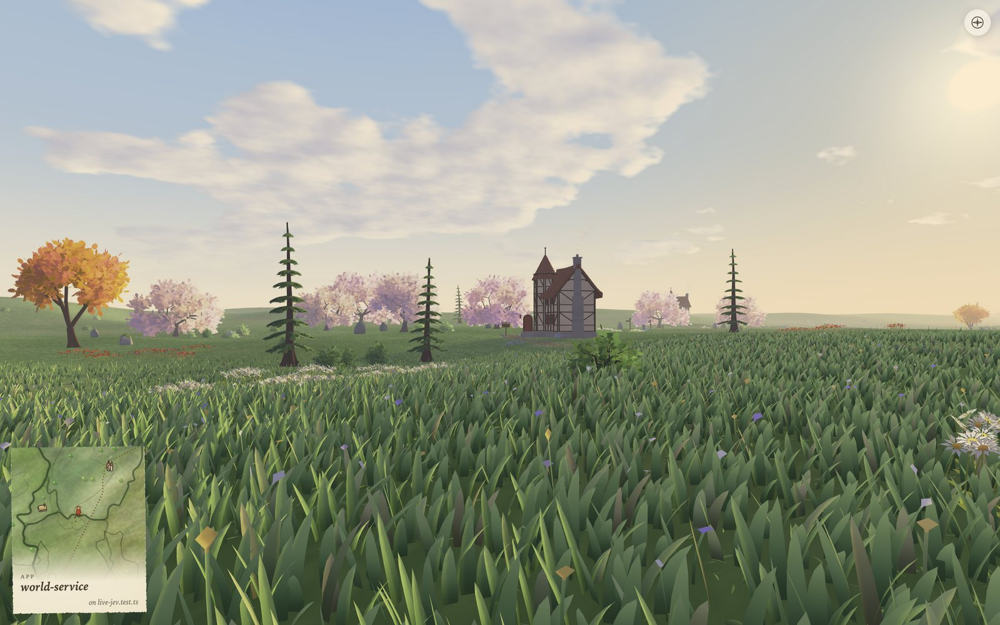

# Gaia



Gaia turns a codebase into a world you walk through at eye height:
directories become land, files grow groves, packages stand as cottages,
towers and great trees, and the dependencies between them wear trails. Every
part of the world shows the health of the code it stands for, so an
untested, tangled file grows a tired tree and a failing package falls
slowly to ruin.

What each thing becomes is chosen by Jev, a decision model reached through
OpenRouter, from facts about the code and never its source. Without a key,
a deterministic stand-in chooses instead.

## Running Gaia

You need macOS, Node 26, pnpm 10 and a stable Rust toolchain from rustup.

```sh
pnpm install
pnpm dev
```

`pnpm dev` builds the engine and opens the app on the start page, where you
choose a folder on your computer, a world you walked before, or the address
of a public repository on GitHub. `GAIA_PROJECT=$PWD pnpm dev` opens this
repository's own world directly.

In the world, click or tap the ground to walk there, drag to look around,
and walk with W A S D or the arrow keys (Shift hurries). Press M for the
field map, and tap a place on it to travel there.

### Connecting Jev

Put your OpenRouter key in the Keychain, then start Gaia live:

```sh
security add-generic-password -s gaia-openrouter -a openrouter -w
GAIA_JEV=live pnpm dev
```

Only the engine reads the key. While Gaia is being built it asks Jev
without a spend limit and prints each run's estimate; judging this
repository costs about two cents. Jev's answers are kept, so reopening a world asks again only about
what changed. [Connecting Jev](docs/connect-jev.md) has the details.

### The lab on a phone or in one file

```sh
pnpm lab:serve          # the lab on this Mac's Tailscale address, port 5180
pnpm lab:html gaia.html # the lab as one offline HTML file
```

Both show Gaia's own world, judged by Jev's kept answers, with no engine
behind them. `pnpm lab:serve` listens only on the Tailscale address and
rebuilds the page whenever the renderer changes.

## The field map


Each area of the map is a directory, and its colors are its code's health:
green where it thrives, turning gold, russet and ash as it fails. Its
patches are files, its little drawings are the packages' buildings and
landmarks, and its dotted lines are the trails between them.

## How it works

```mermaid
flowchart LR
  subgraph engine [Engine, Rust]
    read["Reads files and git history"] --> model[("Code model")]
    client["Jev client, key from the Keychain"]
  end
  subgraph service [World service]
    graph["Code graph"] --> land["Land divided by the code"]
    graph --> questions["Typed questions"]
    kept[("Kept answers")]
    land --> doc[("World document")]
    kept --> doc
  end
  subgraph renderer [Renderer, Three.js]
    bake["Terrain baked on workers"] --> stand["Trees, buildings and trails stood on it"] --> draw["Drawn at eye height"]
  end
  model --> graph
  questions --> client --> jev(["Jev, through OpenRouter"]) --> kept
  doc --> bake
```

The Rust engine reads the code into a model of files, symbols, imports,
tests and history. The world service turns that model into a graph, divides
the land among directories and files by how much code each holds, and asks
Jev a typed question about every choice a person could make differently.
The renderer bakes the terrain on worker threads, stands the world's things
on it and draws it. Electron's main process starts the engine and the world
service and opens the window.

Gaia does not yet watch a project for changes or run its tests, compiler or
linter: reopen a world to see new code, and failing tests and diagnostics
read as none.

## Docs

- [Architecture](docs/architecture.md): the data, the processes, the
  packages and how a world is made from code.
- [Design system](docs/design-system.md): how everything looks and moves.
- [Decisions](docs/decisions/README.md): what the reviewer settled, and why.
- [AGENTS.md](AGENTS.md): the rules, how to run and check Gaia, and the
  contracts between its parts.

`pnpm check` runs the type checker, the lint rules and the tests, and
`cargo test` and `cargo clippy` cover the engine. CI runs all of them on every
push and pull request; the pre-commit hook checks types and lint. `pnpm readme-shots` retakes the screenshots above.
